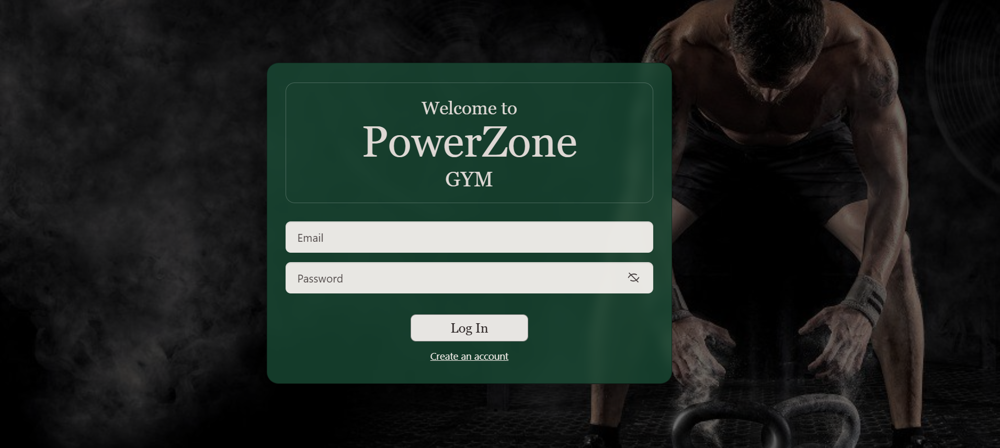
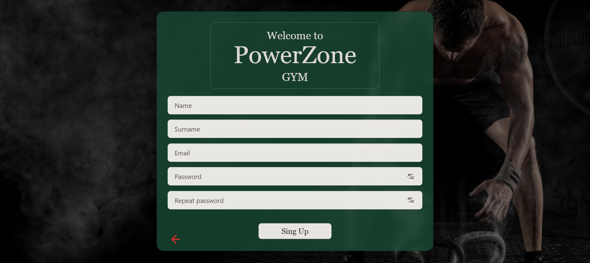
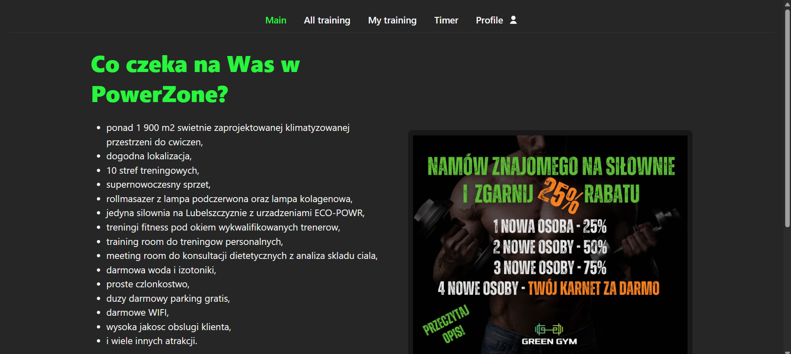
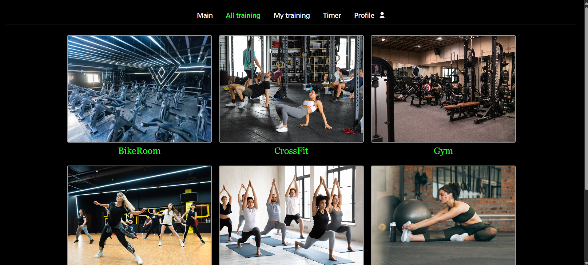
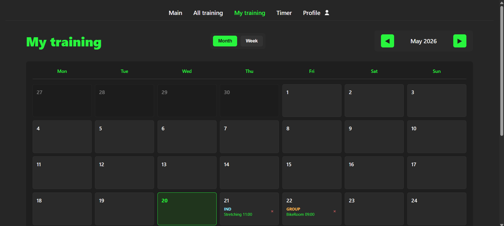
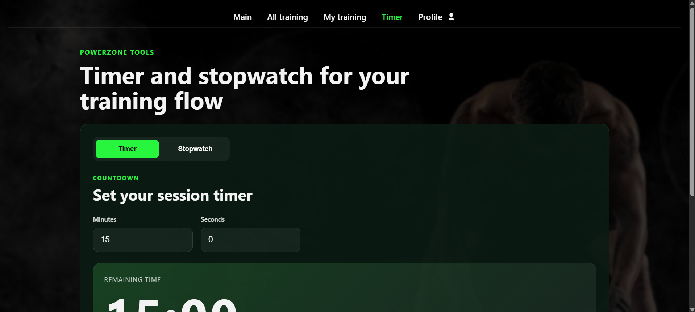
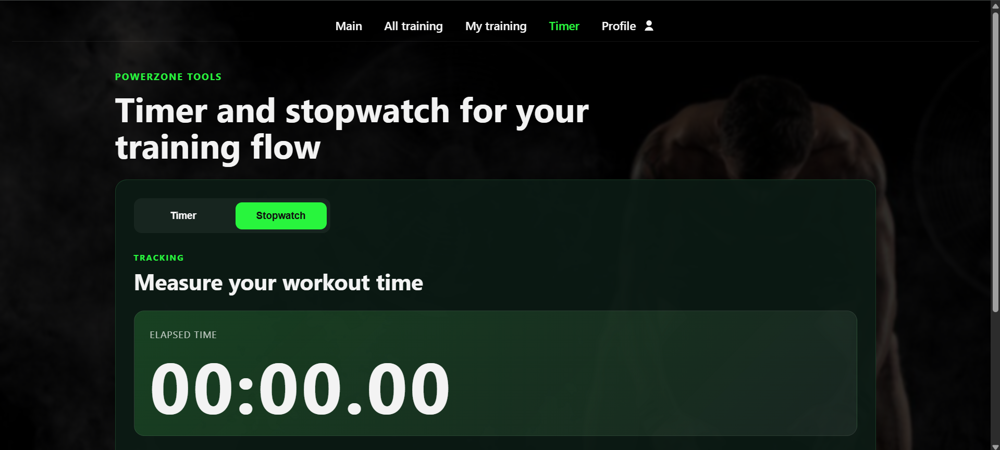
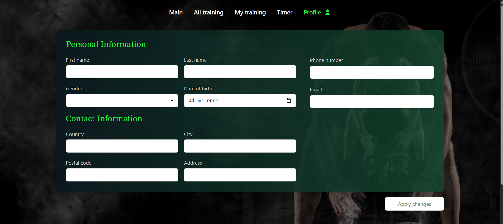

# System Zarządzania Treningami na Siłowni

Aplikacja webowa do zarządzania treningami oraz aktywnością użytkowników siłowni.

---

## Opis projektu

Aplikacja umożliwia użytkownikom przeglądanie dostępnych treningów, zapisywanie się na nie oraz zarządzanie swoimi aktywnościami.

System jest przeznaczony dla osób korzystających z siłowni, które chcą w prosty sposób planować swoje treningi i kontrolować czas ćwiczeń.

Aplikacja rozwiązuje problem organizacji treningów oraz ułatwia dostęp do informacji o dostępnych zajęciach w jednym miejscu.

---

## Sprint plan

Sprint 1 | Cel (Milestone 1 – Konfiguracja Projektu): Prototyp aplikacji + logowanie/rejestracja | 26.03.2026  
Sprint 2 | Cel (Milestone 2 – Implementacja Głównych Modułów): Strona główna + moduł treningów | 09.04.2026  
Sprint 3 | Cel (Milestone 3 – Integracja Frontendu i Backendu): Integracja frontend + backend | 23.04.2026  
Sprint 4 | Cel (Milestone 4 – Zakończenie Projektu): Testowanie i optymalizacja | 07.05.2026  

---

## Autorzy

* Hanna Kryhina – backend / frontend
* Evelina Kuroiedova – testowanie / UI
* Vladyslav Kvitka – backend / frontend

---

## Technologie

Frontend:

* HTML
* CSS
* JavaScript

Backend:

* Node.js + Express

---

## Funkcjonalności

* rejestracja użytkownika
* logowanie i wylogowanie
* zarządzanie profilem
* przeglądanie treningów
* zapisywanie się na trening
* usuwanie treningów
* timer treningowy

Checklist:

* logowanie
* rejestracja
* lista treningów
* zapis na trening
* statystyki treningów

---

## Architektura

Aplikacja jest zbudowana w architekturze klient–serwer.

Frontend komunikuje się z backendem za pomocą REST API.
Backend odpowiada za logikę biznesową oraz komunikację z bazą danych.

---

#  Uruchomienie aplikacji

##  Wymagania

Upewnij się, że na komputerze są zainstalowane:

- [Node.js](https://nodejs.org/)
- npm

## Instalacja i uruchomienie

1. Sklonuj repozytorium
git clone https://github.com/VKvitka/Project-Gym.git

2. Przejdź do katalogu projektu
cd Project-Gym

3. Przejdź do folderu backend
cd backend

4. Zainstaluj zależności
npm install

5. Uruchom serwer
node server.js

## Uruchom aplikację w przeglądarce

Po uruchomieniu serwera otwórz w przeglądarce:

http://localhost:3000

---

##  Design (Figma)

Projekt UI jest dostępny w Figma:
https://www.figma.com/proto/1kIRCY3VyRmS96xGtXEPpH/Untitled?node-id=2012-542&t=Ozb12o0r7Ml4MLfQ-1

---

## Instrukcja użytkownika

1. Otwórz przeglądarkę
2. Przejdź na adres:
   http://localhost:3000
3. Utwórz konto
4. Zaloguj się
5. Wybierz trening i zapisz się na niego
6. Korzystaj z timera podczas ćwiczeń

---

## Struktura projektu

frontend/ – interfejs użytkownika
backend/ – logika aplikacji
docs/ – dokumentacja

---

## API

POST /api/register  
POST /api/login  
GET /api/trainings  
POST /api/trainings/enroll  
DELETE /api/trainings/enroll/{id}  

---

## Zrzuty ekranu
Strona logowania

Strona rejestracji

Strona główna

Strona wszystkie treningy

Strona moje treningi

Strona tajmera

Strona stopera

Strona użytkownika

---

## Status projektu

Zakończony.

---

## Licencja

Projekt edukacyjny.
